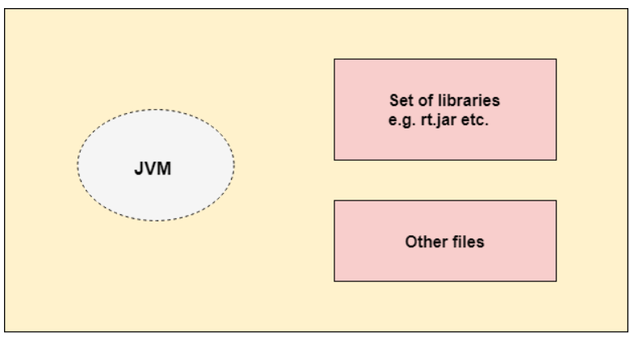
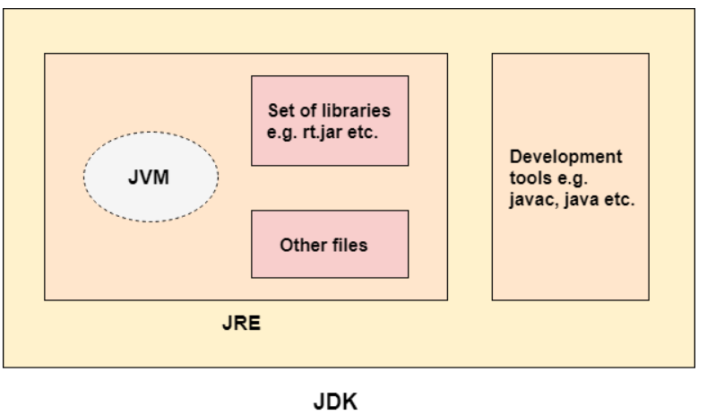

# JVM - Java Virtual Machine
- It's an abstract virtual Machine because it doesn't physically exist.
- It provides a runtime environment in which Java bytecode cane be executed.
- JVM Performs the following main tasks:
     - Loads Code
     - Verifies Code
     - Executes Code
     - Provide runtime environment
- JVM is platform-dependent, as it's designed specifically for different operating systems and hardware architecture.

# JRE - Java Runtime Environment
- It's a set of software tools used for developing Java applications.
- It will provide the runtime environment.
- It's the implementation of JVM.
- It physically exists and it contains set of libraries and other files that the JVM uses at run time. 

# JDK - Java Development Kit
- It contains JRE + development tools.
- The JDK contains a private JVM and a few other resources such as an 
     - interpretr/loader(java)
     - a compiler (javac)
     - an archiver (jar)
     - a documentation generator (Javadoc)

**_References (for studying):_**

[About JVM](https://www.tpointtech.com/jvm-java-virtual-machine)

[JDK vs JRE vs JVM](https://www.tpointtech.com/difference-between-jdk-jre-and-jvm)

# Java Byte Code

### **What is Byte Code?**

- Bytecode is the intermediate, platform-independent code stored in a .class file, generated by the Java compiler and executed by the JVM.
- The bytecode is designed to be understood by the JVM rather than  directed by Windos, Linux or MacOS.
- That's why Java follows the idea: **_Write Once, Run Anywhere_**

## Write Once, Run Anywhere (WORA)

- WORA means that Java code written by the developer cam be compiled and converted into bytecode and that bytecode can be run on different operating systems as long as they do have their own compatible Java virtual Machine.
- Example: I created HelloWorld.java which wil help to create HellowWorld.class. This .class file can be executed on linux or MacOs without throwing any error because JVM on each platform handles the platform -specific execution.  

