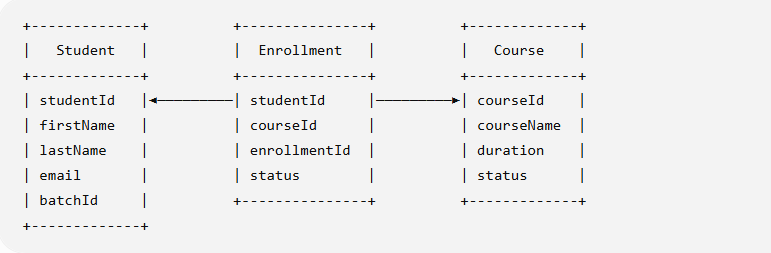

# **Project Overview:**


**Airtribe LearnTrack** is a console-based Student & Course Management System developed using Core Java. The primary objective of the application is to provide administrators with a simple and structured way to manage student information, course information, and student enrollments.

The application runs through a command-line interface (CLI), where administrators can select different operations from a menu. The system processes the administrator's input, performs the requested operation, and displays the result directly in the console.

#### Main Objectives:

- Maintain student information.
- Maintain course information.
- Allow students to enroll in available courses.
- Retrieve and display student details.
- Retrieve and display course details.
- View enrollment information.
- Validate user input.
- Handle invalid input without crashing the application.
- Provide a simple menu-driven console interface.
- Demonstrate practical usage of Core Java concepts.

#### Student Management
- Add New Student
- View all Student
- Search student by Student ID
- deactivate a student


#### Course Management
- Add new course
- View all courses
- Activate/Deactivate a course

#### Enrollment Management
- Enroll a student to a course
- View enrollments for  a student
- Mark enrollment as Completed/Cancelled.

#### Application Flow

                  Start Application
                         │
                         ▼
                  Display Main Menu
                         │
                         ▼
              Administrator selects option
                         │
          ┌──────────────┼──────────────┐
          ▼              ▼              ▼
      Students        Courses       Enrollments
          │              │              │
          ▼              ▼              ▼
     Perform CRUD     Manage Courses   Manage Enrollment
      Operations       Operations        Operations
          │              │              │
          └──────────────┼──────────────┘
                         ▼
                  Display Result
                         │
                         ▼
                  Return to Menu
                         │
                         ▼
                 Exit Application

#### Suggested Entity Relationship



#### Project Structure

```text
Assignment/
│
├── .idea/
│
├── out/
│
├── src/
│   │
│   └── com/
│       │
│       └── airtribe/
│           │
│           └── learntrack/
│               │
│               ├── docs/
│               │   └── Setup_Instructions.md
│               │
│               ├── entity/
│               │   ├── Course.java
│               │   ├── Enrollment.java
│               │   ├── Person.java
│               │   └── Student.java
│               │
│               ├── service/
│               │   ├── CourseManagement.java
│               │   ├── EnrollmentManagement.java
│               │   └── StudentManagement.java
│               │
│               ├── ui/
│               │   └── Main.java
│               │
│               └── util/
│                   └── Helpers.java
│
└── ...


