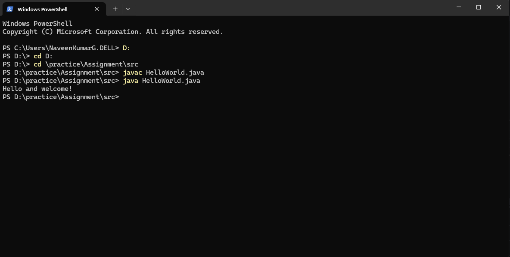
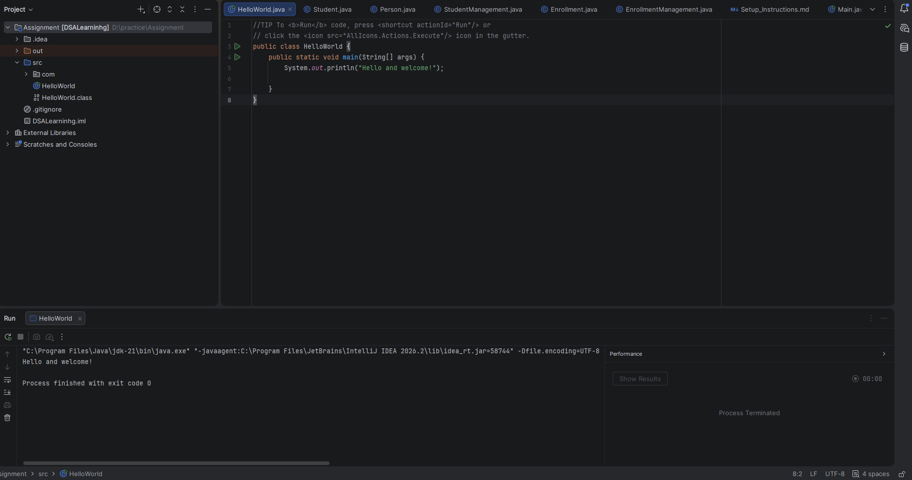

# JDK Version

Project: Airtribe Learn Track Management System
Version: 21.0.8

# Hello World Program Execution:
A basic Java program can be created in the below format

public class HelloWorld {
public static void main(String[] args) {
System.out.println("Hello and welcome!");
    }
}
(For code refer to path: src/HelloWorld.java)

Running the Program:
1. Open the terminal in the directory containing the file.
2. Compile the Program: javac HellowWorld.java
3. Run the compiled program: java HelloWorld

Expected OutPut: Hello and welcome!

### What happens when we run it?
                HelloWorld.java
                     │
                     │  javac HelloWorld.java
                     ▼
              HelloWorld.class
              (Java Bytecode)
                     │
                     │  java HelloWorld
                     ▼
                   JVM
          (Java Virtual Machine)
                     │
                     ▼
             Class Loader
                     │
                     ▼
          Bytecode Verification
                     │
                     ▼
        JVM Runtime / Execution Engine
                     │
                     ▼
        main(String[] args) method
                     │
                     ▼
       System.out.println("Hello World")
                     │
                     ▼
              Console Output
                     │
                     ▼
              Hello World

#### Command Prompt

##### Powershell

